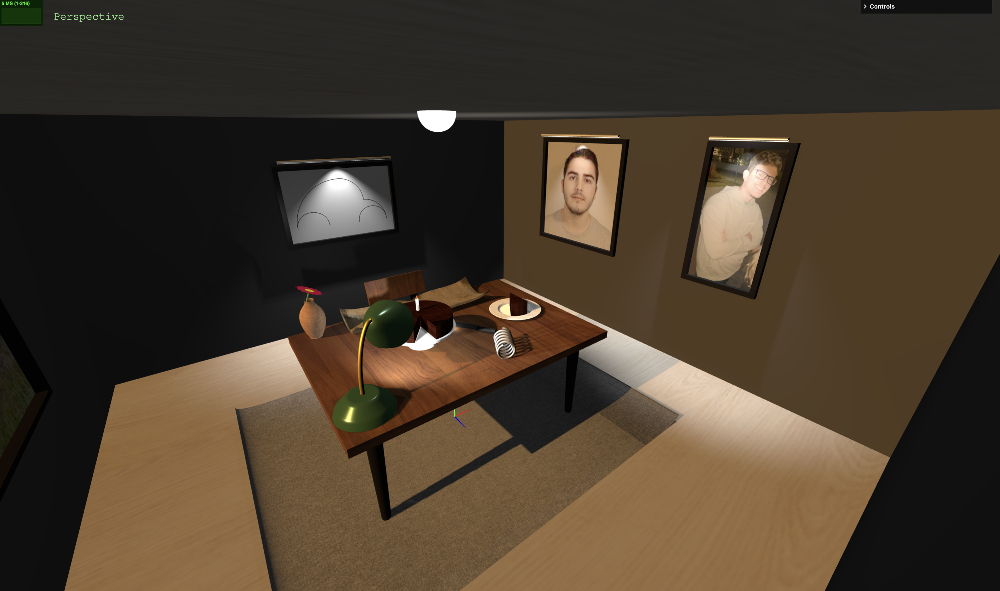

# SGI 2024/2025 - TP1

## Group: T08G07

| Name             | Number    | E-Mail             |
| ---------------- | --------- | ------------------ |
| Gonçalo Martins  | 202108707 |  up202108707@up.pt |
| Diogo Viana      | 202108803 |  up202108803@up.pt |

----
## Project information

<!-- (items briefly describing main strong points) -->
#### Items:
  - Curves: The curves are observable in multiple components in the scene, for instance: the flower stem, which consists of a cubic bezier curve, the metal spring, which is a catmullrom curve, the "beetle" car, which was built using 5 cubic bezier curves, the newspaper and the jar built with two curved surfaces each, and finally the fabric curls on the edges of the carpet which also used curved surfaces.
  - Lights: In the scene it's possible to observe a wide variety of lights, such as: an ambient light, 2 point lights, one on the lamp on the ceiling of the scene and the other placed on the flame of the candle, and finally, 5 spotlights, 3 of them being placed on the lamps above each of the paintings, 1 above the cake, and the last one placed outside of the window simulating sunlight.
  - Components realism: The components have been crafted using mainly three.js primitives in a creative way in order to make them look very realistic, also making use of different types of materials to simulate even better the characteristics of the real objects.

#### Scene:
  <!-- (Brief description of the created scene) -->
  - Description: Living room with diverse components displayed, such as: window with a dynamic background landscape, three paintings hanging on the walls, two of them portraiting the group members and the third one displaying a "beetle" car created using only cubic curbs, a carpet, a chair, a table, three lamps on top of each painting and two more: one being on the ceiling and another one placed on the table. Then it's possible to visualize multiple objects placed on top of the table such as: a cake platter with a sliced cake on top of it, a knife, a plate with a slice of the cake on top of it, a metal spring, a newspaper placed in front of the chair and finally a jar with a flower inside it.
  <!-- (relative link to the scene) -->
  - [Scene](../Proj1/index.html)

  
  
  

#### Controls

In the GUI interface, the user can control the plane material and texture, the active camera and a wide variety of options to control the lights presented in the scene. 

For the cameras, the `Perspective 1` and `Perspective 2` cameras have different initial positions and these positions can be changed using the mouse and, in the case of the `Perspective 1` camera, the coordinate inputs seen on the GUI. As for the rest, these are static cameras to look at the scene from each side of it, having a starting point a little higher than the origin (based on the table's height).

For the light controls, most lights can be altered in almost all variables. Most of this lights are associated with objects, so the group thought it made sense to disable customization of the light's position. The `Directional Light`, that represents sunlight, is the only exception.

As for the plane texture, you can customize the texture itself and the color and shininess of the object.

  

  

  

----
## Issues/Problems

- There are some bugs on the meshes visuals, mainly on the right surface of the carpet, when the material has the variable side as `THREE.DoubleSide` and the mesh's castShadow variable is set to `True`.
- Some complex object shadows, like the `Cake Slice Platter`, might be missing some sections or look weird.
- The group deactivated the `castShadow` for the window wall, because it did not look great and it was not calculating the full shadow for reasons the group does not fully understand.
- The group has not fully accomplished the use of `Advanced Textures`.
- In the GUI Interface, the color picker option for the lights, with the exception of the `Directional Light`, is not assigning the color when using the mouse to select the color. If the user replaces the hexcode on the side with the keyboard, the color is assigned. The group was not able to identify why it was happening in one case but not the others, as all functions were the same.
- Only the `Perspective 1` camera is changing positions in the GUI. It makes sense that it does not change for the orthogonals, because we want them to be static, but it should be changing for the `Perspective2` camera. 
- The Orthogonal cameras can only see the table and the objects placed in it, and not the walls.
