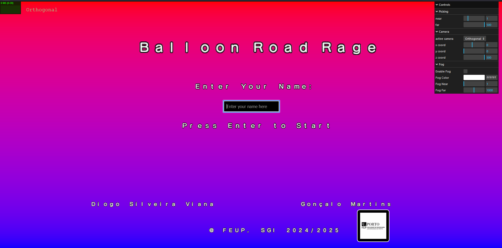
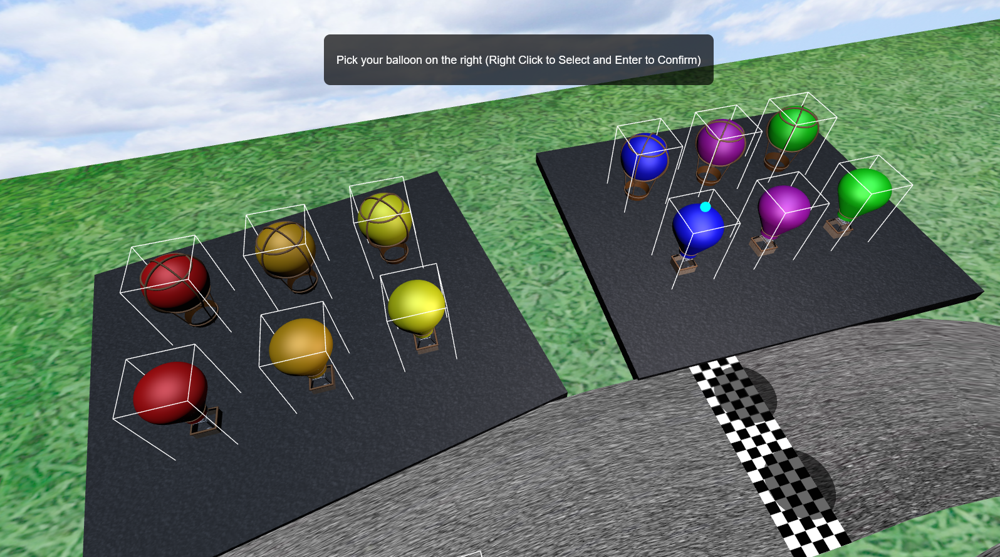
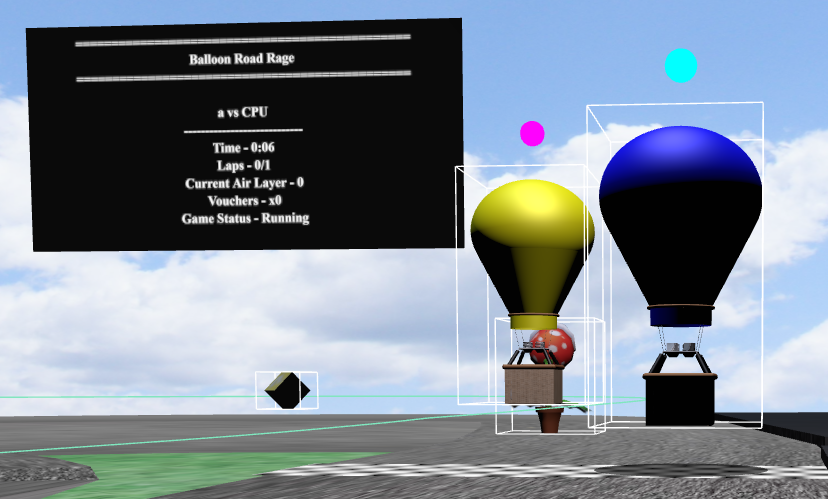
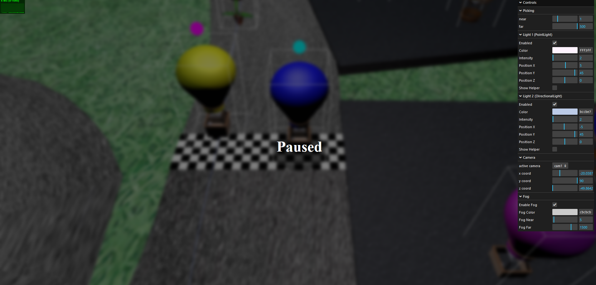
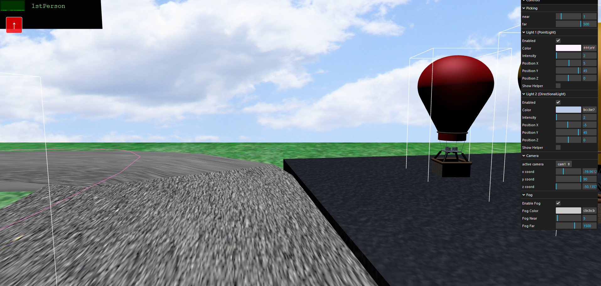
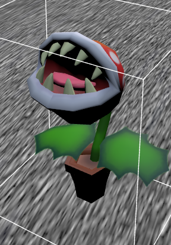
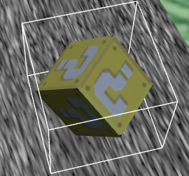
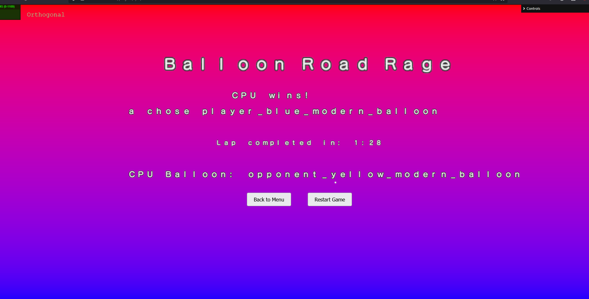
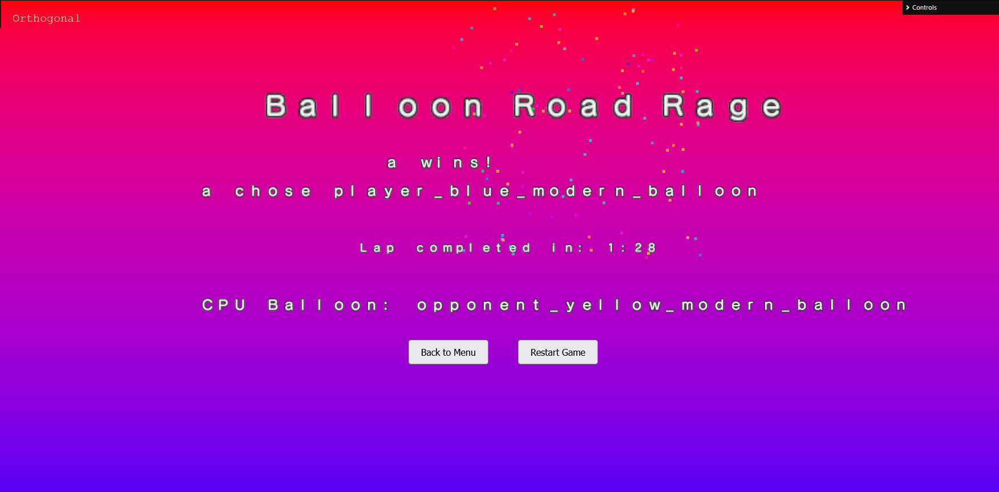

# SGI 2024/2025 - TP3

## Group: T08G07

| Name             | Number    | E-Mail             |
| ---------------- | --------- | ------------------ |
| Gonçalo Martins  | 202108707 |  up202108707@up.pt |
| Diogo Viana      | 202108803 |  up202108803@up.pt |

----
## Project information

### Scene
  We went with a Mario Kart style scene for this game (but with balloons), with a Piranha Plant model (designed by [Marcus Vinicius](https://sketchfab.com/ramosmarcus17) under this [license](http://creativecommons.org/licenses/by/4.0/)) and some power up blocks.

  This Mario Kart choice can also be seen in the spritesheet we chose, based on Mario Kart Wii letters.

### Movement

To run, use Live Server extension or any other tool to launch a development local server, which file is index.html.

#### Home Menu

In menu, all that is needed is for you to input a name and press `Enter` to move on to the next step.

#### Picking Balloons

When picking balloons, the instructions will appear in html at the top of the screen.

Select a balloon on the parking lot on the right side of the screen with a `mouse right click` and press `Enter` to confirm. This will be your balloon.

Select a ballon on the parking lot on the left side of the screen with a `mouse right click` and press `Enter` to confirm. This will be the autonomous balloon.

Finally, select one of the shadows above the finish line to select your starting position and click `Enter` to start the game.

#### In Game

When In Game, the balloon can be moved using ‘W’ to move upwards and ‘S’ downwards unless it hits a limit height. The height of the balloon will determine to where it moves:
The air is divided in 5 horizontal layers, each one having wind in one direction:
- Layer 4: (highest layer) wind moves to West (left)
- Layer 3: wind moves to East (right)
- Layer 2: wind moves to South (backwards)
- Layer 1: wind moves to North (forward)
- Layer 0: (lowest layer) there is no wind

You can also press the `Escape` button to exit back to the main menu and the `Spacebar` button to pause the game.

The `c` letter can be pressed to toggle between `1st` and `3rd` person camera.

The autonomous balloon will move within a line that will show above the track. Hitting the autonomous balloon’s hitbox will freeze you for 3 seconds!

A shadow will show directly below the balloon that will track whether you're staying on track or not. If you leave the track, the balloon will be moved to the nearest point at the centre of
the track
Piranha Plants from Super Mario can be seen around the track. Hitting these will have the same effect as hitting the opposite balloon,
freezing you for 3 seconds.

After hitting objects, a small invincibility time is considered to allow you to move again.

There are also power ups (boxes) around the track. Hitting power-ups will give you 1 voucher that will allow you to not be on cooldown if you hit a piranha, the autonomous balloon or leave the track.

The same invincibility is applied to power ups, in order to not allow you to gain multiple vouchers at once.

#### Final Menu

The final menu displays information about the results of the game. To get out of this menu, either press the `Restart Game` Button, which will send you straight to another game with the same settings, or press the `Back to Menu` button, which will send you back to the main menu.

### Have fun! 

## Issues/Problems

- Shaders are not properly implemented/left unfinished due to lack of time.
- In the picking balloon state, you are able to pick the starting point and opponent balloon while picking your balloon (as the marker will pop above that object), but you will not be able to confirm that object when pressing ENTER. The same happens for the entire picking stage.
- Also in the picking stage, it might look like you can't select the balloons sometimes, but that is because of the existence of the bounding boxes around the balloons, which are not pickable objects.
- 1st Person cameras in the front line balloons can be a bit misplaced/bugged.
