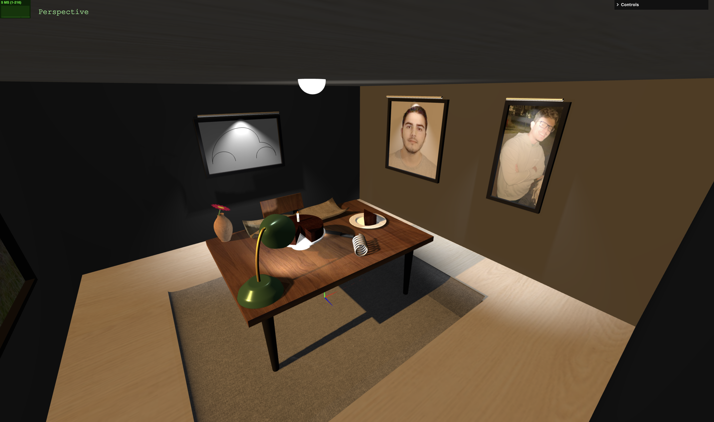
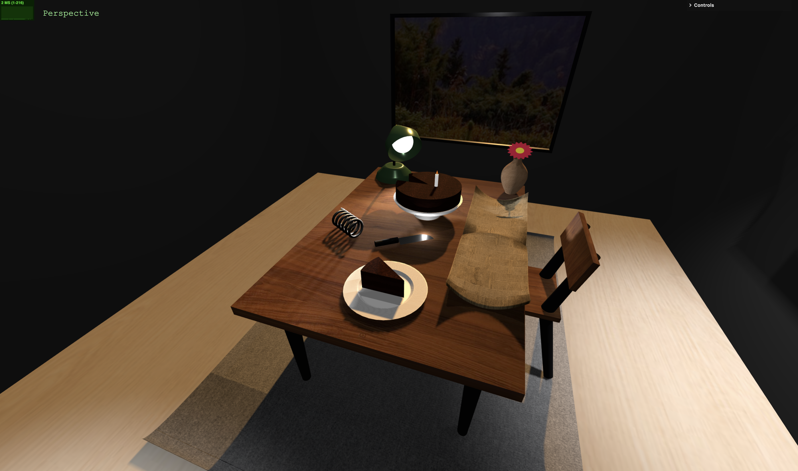
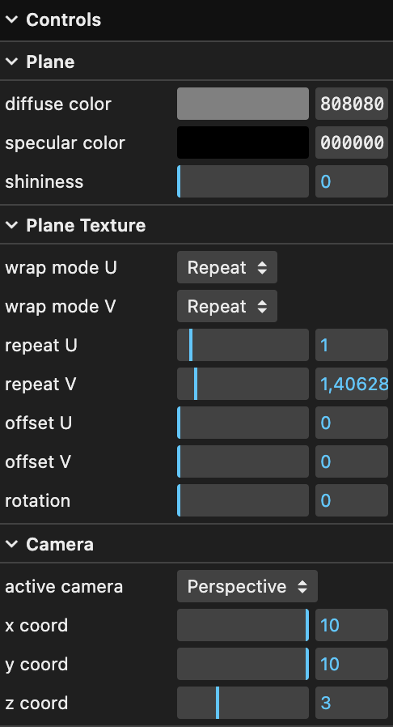
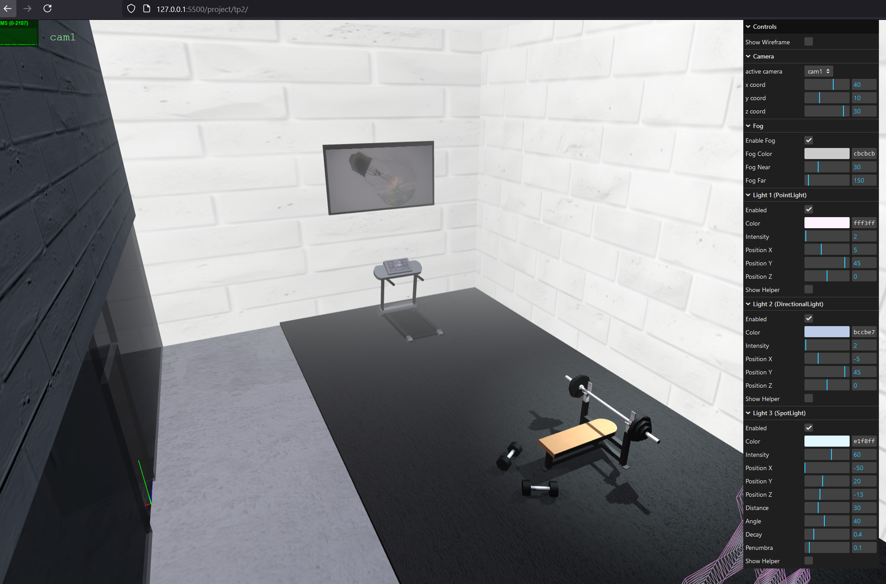

# SGI 2024/2025

## Group: T08G07

| Name             | Number    | E-Mail             |
| ---------------- | --------- | ------------------ |
| Gonçalo Martins  | 202108707 |  up202108707@up.pt |
| Diogo Viana      | 202108803 |  up202108803@up.pt |

----

## Projects

### [TP1 - ThreeJS Basics](Proj1)

<!-- (items briefly describing main strong points) -->
#### Items:
  - Curves: The curves are observable in multiple components in the scene, for instance: the flower stem, which consists of a cubic bezier curve, the metal spring, which is a catmullrom curve, the "beetle" car, which was built using 5 cubic bezier curves, the newspaper and the jar built with two curved surfaces each, and finally the fabric curls on the edges of the carpet which also used curved surfaces.
  - Lights: In the scene it's possible to observe a wide variety of lights, such as: an ambient light, 2 point lights, one on the lamp on the ceiling of the scene and the other placed on the flame of the candle, and finally, 5 spotlights, 3 of them being placed on the lamps above each of the paintings, 1 above the cake, and the last one placed outside of the window simulating sunlight.
  - Components realism: The components have been crafted using mainly three.js primitives in a creative way in order to make them look very realistic, also making use of different types of materials to simulate even better the characteristics of the real objects.

#### Scene:
  <!-- (Brief description of the created scene) -->
  - Description: Living room with diverse components displayed, such as: window with a dynamic background landscape, three paintings hanging on the walls, two of them portraiting the group members and the third one displaying a "beetle" car created using only cubic curbs, a carpet, a chair, a table, three lamps on top of each painting and two more: one being on the ceiling and another one placed on the table. Then it's possible to visualize multiple objects placed on top of the table such as: a cake platter with a sliced cake on top of it, a knife, a plate with a slice of the cake on top of it, a metal spring, a newspaper placed in front of the chair and finally a jar with a flower inside it.
  <!-- (relative link to the scene) -->
  - [Scene](./Proj1/index.html)

  
  
  

#### Controls

In the GUI interface, the user can control the plane material and texture, the active camera and a wide variety of options to control the lights presented in the scene. 

For the cameras, the `Perspective 1` and `Perspective 2` cameras have different initial positions and these positions can be changed using the mouse and, in the case of the `Perspective 1` camera, the coordinate inputs seen on the GUI. As for the rest, these are static cameras to look at the scene from each side of it, having a starting point a little higher than the origin (based on the table's height).

For the light controls, most lights can be altered in almost all variables. Most of this lights are associated with objects, so the group thought it made sense to disable customization of the light's position. The `Directional Light`, that represents sunlight, is the only exception.

As for the plane texture, you can customize the texture itself and the color and shininess of the object.

  

  

  

----

### [TP2 - Parser](Proj2)

<!-- (items briefly describing main strong points) -->
#### Items:
- Bump and specular maps: We went deep with the development of bumper and specular maps, creating them ourselves from the base image in an open-source application.
- Small details: Our gym components are really thorough in small details. For example, you can see, at the back of the bench press, two pin caps that allow a user in real life to increase/decrease the bar's height. Another very interesting detail is the roller bars below the treadmill's belt.
- Scene controlability: We believe that the controlability of available elements in the interface is really thourough, being able to turn them on/off, show helpers for lights, change positioning, etc.
- Fog: The fog looks really nice with the swimming pool object, as it looks like the pool is releasing vapor in the scene.

#### Scene:
<!-- (Brief description of the created scene) -->
For our tp2 scene we decided to create a gym, with a treadmill, a bench press, some dumbbells, weight disks, a TV, some polygons emulating a symbol made of LED panels, a partition with a transparent glass and door to separate a swimming pool from the rest of the gym.

#### Controls:

Our scene offers a lot of control on non-primitive objects like fog and lights. The user can alter through the cameras that have been defined in the json file.

For the fog, you can enable/disable it, change it's color and near and far parameters.

For the lights, you can also enable/disable, chang color, intensity and position, as well as show the light helper. Spotlight has some extra controls, like distance, angle, decay and penumbra.

There is also an option to enable all objects' wireframe.

### [TP3 - ...](Proj3)
- (items briefly describing main strong points)
