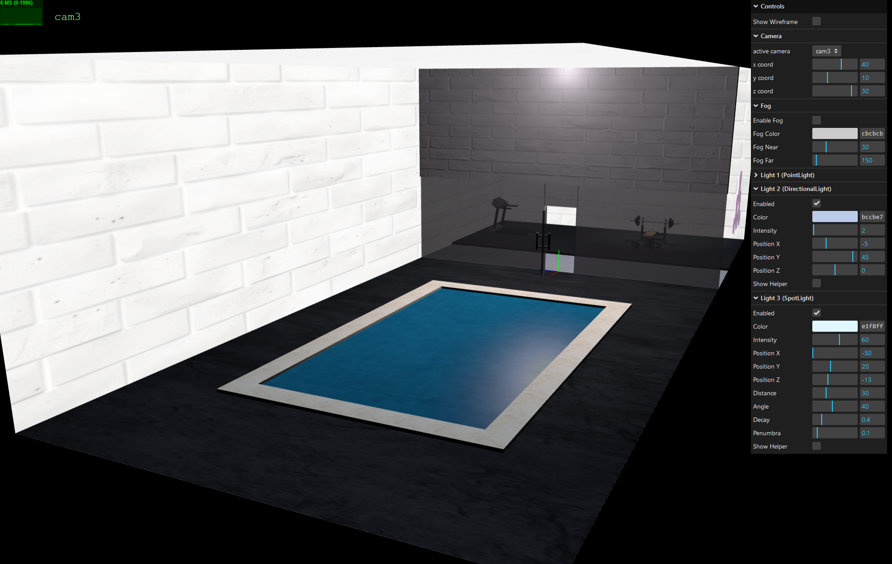
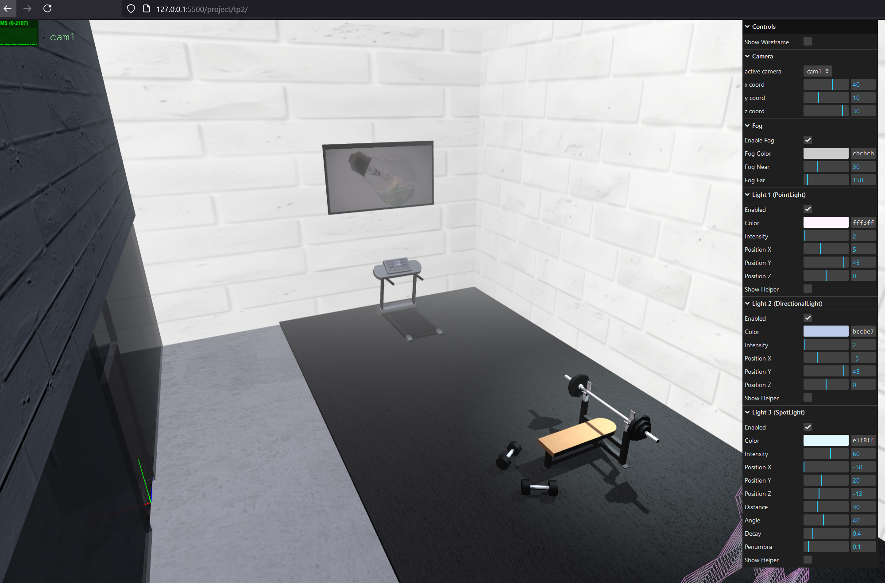

# SGI 2024/2025 - TP2

## Group: T08G07

| Name             | Number    | E-Mail             |
| ---------------- | --------- | ------------------ |
| Gonçalo Martins  | 202108707 |  up202108707@up.pt |
| Diogo Viana      | 202108803 |  up202108803@up.pt |

----

# Getting started

Considering a code block in MyContents.js, to load a json file in YASF format, call:

```
    this.reader = new MyFileReader(this.onSceneLoaded.bind(this));
    reader.open("<path to json file>");	
```

The last argument in the MyFileReader object call is the name of the method that is to be called when the json file is loaded and parsed.

Hence, In the same code block in MyContents.js, there is a function method with the following signature: 

```
    onSceneLoaded(data) {
        // do something with the data object
    }
```

This method is called once the json file is loaded and parsed successfully. This method single input argument, *data*, is an object containing the entire scene data object. This document can be traversed according to the rules defined in the section on MySceneData class.

----

## Project information

<!-- (items briefly describing main strong points) -->
#### Items:
- Bump and specular maps: We went deep with the development of bumper and specular maps, creating them ourselves from the base image in an open-source application.
- Small details: Our gym components are really thorough in small details. For example, you can see, at the back of the bench press, two pin caps that allow a user in real life to increase/decrease the bar's height. Another very interesting detail is the roller bars below the treadmill's belt.
- Scene controlability: We believe that the controlability of available elements in the interface is really thourough, being able to turn them on/off, show helpers for lights, change positioning, etc.
- Fog: The fog looks really nice with the swimming pool object, as it looks like the pool is releasing vapor in the scene.

#### Scene:
<!-- (Brief description of the created scene) -->
For our tp2 scene we decided to create a gym, with a treadmill, a bench press, some dumbbells, weight disks, a TV, some polygons emulating a symbol made of LED panels, a partition with a transparent glass and door to separate a swimming pool from the rest of the gym.





#### Controls:

Our scene offers a lot of control on non-primitive objects like fog and lights. The user can alter through the cameras that have been defined in the json file.

For the fog, you can enable/disable it, change it's color and near and far parameters.

For the lights, you can also enable/disable, chang color, intensity and position, as well as show the light helper. Spotlight has some extra controls, like distance, angle, decay and penumbra.

There is also an option to enable all objects' wireframe.


----

## MyFileReader
File MyFileReader.js contains the class responsible for the json parser general functionality. Most of the parsing process is derived from descriptors defined in MySceneData.js. A small part is hardcoded.

## MySceneData
File MySceneData.js contains a class with metadata description and, in the end of parsing, contains the full set of objects loaded from the json scene file. This class has several important object attributes:
- options: contains the scene options, from the globals section
- fog: contains the scene fog options, from the fog section
- skybox: contains the scene skybox options, from the skybox section
- objects: associative array/list with the scene described primitives
- materials: associative array/list with the scene described materials
- lights: associative array/list with the scene described lights
- textures: associative array/list with the scene described textures
- cameras: associative array/list with all the cameras in the scene
- activeCameraId: the id of the active camera
- nodes: associative array/list with all the scene nodes.
- rootId: the id of the root node

**Notes:**
1. for each entity type, there should be no repeated ids. For instance, if there are two nodes with the same id, the parser will throw an error and the scene will not be loaded.
2. For each loaded entity, the parser will check if all the required attributes are present. If not, the parser will throw an error and the scene will not be loaded.
3. For each entity, a descriptor defined in the constructor defines the attribute's name, type, requiredness, default value.

There are a bunch of getters and setters in this class. There are also functions for conversions, data updates, creating textures and materials, etc.

At the end of the file, there is a function named OnLoadFinished that will do some checkups before rendering the scene, to make sure the scene can be loaded correctly:

- Material Check-Up: All Referenced Materials in the materials array will be created before heading to the scene rendering, so that we do not waste time during the render on material load-up.
- Check Skybox exists
- Check Fog exists
- Check there is a root node to render from
- Check there is a set active camera to render the scene
- Check all angle values used are within the respective range

## MyContents

File MyContents.js contains the class responsible for the scene rendering. This class has a method called onSceneLoaded, where the scene data will be separated and loaded by multiple functions:

- renderGlobals: Render all global options (background color and ambient light)
- renderFog: Render fog
- renderSkybox: Render skybox
- RenderCameras: Render all cameras
- RenderGraph: Render the graph objects

In RenderGraph, we will call createObject for the root node of the graph. CreateObject is a recursive function that will handle graph nodes and it's children based on their type (nodes, primitives, lights, etc.), adding them to groups, applying transformations, passing down materials and cast/receive shadow properties, etc.
